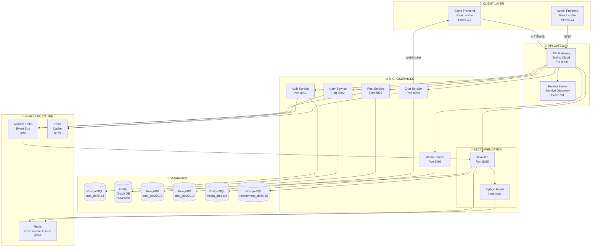

# 🎓 KIẾN TRÚC HỆ THỐNG CTU-CONNECT

## Mô tả tổng quan

**CTU-Connect** là một nền tảng mạng xã hội học thuật dành cho sinh viên và giảng viên Đại học Cần Thơ (CTU). Hệ thống được xây dựng theo kiến trúc **Microservices** với các công nghệ hiện đại, hỗ trợ:

- 🔐 Xác thực và phân quyền người dùng
- 👥 Quản lý hồ sơ và kết bạn
- 📝 Đăng bài viết học thuật
- 💬 Chat real-time
- 🤖 Gợi ý bài viết và bạn bè bằng AI
- 📁 Quản lý media/file

---

## I. SƠ ĐỒ KIẾN TRÚC TỔNG QUAN

```
                                    ┌─────────────────────────────────────────────────────────────────┐
                                    │                         CLIENT LAYER                            │
                                    │  ┌─────────────────┐              ┌─────────────────────────┐   │
                                    │  │  Client Frontend │              │    Admin Frontend       │   │
                                    │  │   (React/Vite)   │              │     (React/Vite)        │   │
                                    │  │    Port: 5173    │              │      Port: 5174         │   │
                                    │  └────────┬────────┘              └───────────┬─────────────┘   │
                                    └───────────┼───────────────────────────────────┼─────────────────┘
                                                │                                   │
                                                │ HTTP/WebSocket                    │ HTTP
                                                ▼                                   ▼
┌───────────────────────────────────────────────────────────────────────────────────────────────────────────────┐
│                                         INFRASTRUCTURE LAYER                                                   │
│   ┌─────────────────────────────────────────────────────────────────────────────────────────────────────────┐ │
│   │                              EUREKA SERVER (Service Discovery)                                           │ │
│   │                                        Port: 8761                                                        │ │
│   └─────────────────────────────────────────────────────────────────────────────────────────────────────────┘ │
│                                                    ▲                                                          │
│                                                    │ Service Registration                                     │
│   ┌─────────────────────────────────────────────────────────────────────────────────────────────────────────┐ │
│   │                               API GATEWAY (Spring Cloud Gateway)                                         │ │
│   │                                        Port: 8090                                                        │ │
│   │  • JWT Validation • Rate Limiting • Load Balancing • Request Routing • CORS Handling                     │ │
│   └──────────────────────────────────────────────┬──────────────────────────────────────────────────────────┘ │
└──────────────────────────────────────────────────┼────────────────────────────────────────────────────────────┘
                                                   │
                     ┌─────────────────────────────┼─────────────────────────────┐
                     │                             │                             │
                     ▼                             ▼                             ▼
┌────────────────────────────────────────────────────────────────────────────────────────────────────────────────┐
│                                          MICROSERVICES LAYER                                                   │
│                                                                                                                │
│  ┌──────────────────┐  ┌──────────────────┐  ┌──────────────────┐  ┌──────────────────┐  ┌──────────────────┐ │
│  │   AUTH SERVICE   │  │   USER SERVICE   │  │   POST SERVICE   │  │   CHAT SERVICE   │  │  MEDIA SERVICE   │ │
│  │  (Spring Boot)   │  │  (Spring Boot)   │  │  (Spring Boot)   │  │  (Spring Boot)   │  │  (Spring Boot)   │ │
│  │   Port: 8091     │  │   Port: 8092     │  │   Port: 8093     │  │   Port: 8094     │  │   Port: 8096     │ │
│  │                  │  │                  │  │                  │  │                  │  │                  │ │
│  │ • Login/Register │  │ • Profile CRUD   │  │ • Post CRUD      │  │ • WebSocket      │  │ • File Upload    │ │
│  │ • JWT Token      │  │ • Friends        │  │ • Comments       │  │ • Real-time Chat │  │ • Image Process  │ │
│  │ • OAuth2         │  │ • Follow/Block   │  │ • Likes          │  │ • Conversations  │  │ • S3 Storage     │ │
│  │ • Refresh Token  │  │ • Search Users   │  │ • Tags           │  │ • Messages       │  │                  │ │
│  └────────┬─────────┘  └────────┬─────────┘  └────────┬─────────┘  └────────┬─────────┘  └────────┬─────────┘ │
│           │                     │                     │                     │                     │          │
│           ▼                     ▼                     ▼                     ▼                     ▼          │
│  ┌──────────────────┐  ┌──────────────────┐  ┌──────────────────┐  ┌──────────────────┐  ┌──────────────────┐ │
│  │   PostgreSQL     │  │     Neo4j        │  │    MongoDB       │  │    MongoDB       │  │   PostgreSQL     │ │
│  │   (auth_db)      │  │  (Graph DB)      │  │   (post_db)      │  │   (chat_db)      │  │   (media_db)     │ │
│  │   Port: 5433     │  │ Port: 7474/7687  │  │   Port: 27018    │  │   Port: 27019    │  │   Port: 5434     │ │
│  └──────────────────┘  └──────────────────┘  └──────────────────┘  └──────────────────┘  └──────────────────┘ │
│                                                                                                                │
│  ┌─────────────────────────────────────────────────────────────────────────────────────────────────────────┐  │
│  │                              RECOMMENDATION SERVICE (Hybrid: Java + Python)                              │  │
│  │  ┌──────────────────────────────────┐         ┌──────────────────────────────────┐                       │  │
│  │  │     JAVA API (Spring Boot)       │         │     PYTHON MODEL (FastAPI)       │                       │  │
│  │  │          Port: 8095              │  HTTP   │          Port: 8000              │                       │  │
│  │  │                                  │ ◄─────► │                                  │                       │  │
│  │  │  • REST API for Frontend         │         │  • PhoBERT AI Model              │                       │  │
│  │  │  • Orchestrate Recommendation    │         │  • Text Embedding                │                       │  │
│  │  │  • Kafka Consumer                │         │  • Cosine Similarity             │                       │  │
│  │  │  • Redis Cache Management        │         │  • Batch Inference               │                       │  │
│  │  │  • Neo4j/PostgreSQL Access       │         │                                  │                       │  │
│  │  └──────────────┬───────────────────┘         └──────────────┬───────────────────┘                       │  │
│  │                 │                                            │                                           │  │
│  │                 ▼                                            ▼                                           │  │
│  │  ┌──────────────────────────────────┐         ┌──────────────────────────────────┐                       │  │
│  │  │  PostgreSQL (recommend_db)       │         │     Redis (recommend-redis)      │                       │  │
│  │  │        Port: 5435                │         │        Port: 6380                │                       │  │
│  │  └──────────────────────────────────┘         └──────────────────────────────────┘                       │  │
│  └─────────────────────────────────────────────────────────────────────────────────────────────────────────┘  │
└────────────────────────────────────────────────────────────────────────────────────────────────────────────────┘

┌────────────────────────────────────────────────────────────────────────────────────────────────────────────────┐
│                                          SHARED INFRASTRUCTURE                                                 │
│                                                                                                                │
│  ┌─────────────────────────────────┐    ┌─────────────────────────────────┐                                   │
│  │      KAFKA (Event Streaming)    │    │        REDIS (Global Cache)     │                                   │
│  │   Port: 9092 (External)         │    │        Port: 6379               │                                   │
│  │   Port: 29092 (Internal)        │    │                                 │                                   │
│  │                                 │    │  • Session Storage              │                                   │
│  │  • Post Events                  │    │  • Rate Limiting                │                                   │
│  │  • User Activity Events         │    │  • Cache Hot Data               │                                   │
│  │  • Recommendation Triggers      │    │                                 │                                   │
│  │  • Notification Events          │    │                                 │                                   │
│  └─────────────────────────────────┘    └─────────────────────────────────┘                                   │
└────────────────────────────────────────────────────────────────────────────────────────────────────────────────┘
```

---

## II. SƠ ĐỒ LUỒNG DỮ LIỆU (DATA FLOW)



---

## III. MÔ TẢ CHI TIẾT TỪNG THÀNH PHẦN

### 1. 🖥️ CLIENT LAYER

| Component | Technology | Port | Description |
|-----------|------------|------|-------------|
| **Client Frontend** | React + Vite | 5173 | Giao diện người dùng chính: đăng nhập, xem bài viết, chat, kết bạn |
| **Admin Frontend** | React + Vite | 5174 | Giao diện quản trị: quản lý user, bài viết, thống kê |

### 2. 🚪 INFRASTRUCTURE LAYER

#### Eureka Server (Service Discovery)
- **Port:** 8761
- **Vai trò:** Đăng ký và khám phá service
- **Tính năng:**
  - Tự động đăng ký microservices
  - Health check định kỳ
  - Load balancing thông tin

#### API Gateway (Spring Cloud Gateway)
- **Port:** 8090
- **Vai trò:** Entry point duy nhất cho tất cả requests
- **Tính năng:**
  - JWT Authentication/Authorization
  - Request routing đến microservices
  - Rate limiting
  - CORS handling
  - Load balancing
  - Circuit breaker

### 3. ⚙️ MICROSERVICES LAYER

#### Auth Service
| Attribute | Value |
|-----------|-------|
| **Port** | 8091 |
| **Framework** | Spring Boot |
| **Database** | PostgreSQL (auth_db:5433) |
| **Chức năng** | Đăng ký, đăng nhập, JWT token, OAuth2, Refresh token |

#### User Service
| Attribute | Value |
|-----------|-------|
| **Port** | 8092 |
| **Framework** | Spring Boot |
| **Database** | Neo4j (7474/7687) |
| **Chức năng** | Quản lý profile, kết bạn, theo dõi, block, tìm kiếm user |

> **Lý do dùng Neo4j:** Quan hệ bạn bè là dạng đồ thị (graph), Neo4j tối ưu cho truy vấn quan hệ phức tạp như "bạn của bạn", "gợi ý kết bạn".

#### Post Service
| Attribute | Value |
|-----------|-------|
| **Port** | 8093 |
| **Framework** | Spring Boot |
| **Database** | MongoDB (post_db:27018) |
| **Chức năng** | CRUD bài viết, comments, likes, tags, tìm kiếm |

> **Lý do dùng MongoDB:** Bài viết có cấu trúc linh hoạt (text, hình ảnh, file, tags), MongoDB phù hợp cho dữ liệu semi-structured.

#### Chat Service
| Attribute | Value |
|-----------|-------|
| **Port** | 8094 |
| **Framework** | Spring Boot + WebSocket |
| **Database** | MongoDB (chat_db:27019), Redis |
| **Chức năng** | Real-time chat, conversations, messages history |

**Kiến trúc Chat:**
```
┌─────────────┐      WebSocket      ┌─────────────┐
│   Client    │ ◄─────────────────► │ Chat Service│
└─────────────┘                     └──────┬──────┘
                                           │
                    ┌──────────────────────┼──────────────────────┐
                    │                      │                      │
                    ▼                      ▼                      ▼
            ┌─────────────┐       ┌─────────────┐        ┌─────────────┐
            │   Redis     │       │  MongoDB    │        │    Kafka    │
            │ (Real-time) │       │  (History)  │        │  (Events)   │
            └─────────────┘       └─────────────┘        └─────────────┘
```

#### Media Service
| Attribute | Value |
|-----------|-------|
| **Port** | 8096 |
| **Framework** | Spring Boot |
| **Database** | PostgreSQL (media_db:5434) |
| **Chức năng** | Upload file, xử lý hình ảnh, lưu trữ |

#### Recommendation Service (Hybrid Architecture)
| Component | Technology | Port | Vai trò |
|-----------|------------|------|---------|
| **Java API** | Spring Boot | 8095 | REST API, orchestration, cache, Kafka consumer |
| **Python Model** | FastAPI + PhoBERT | 8000 | AI inference, embedding, similarity |

**Chi tiết kiến trúc Recommendation:**
```
                          ┌─────────────────────────────────────────┐
                          │         RECOMMENDATION SERVICE          │
                          │                                         │
┌─────────────┐          │  ┌─────────────────────────────────┐   │
│   Frontend  │ ───────► │  │       JAVA API (Port 8095)      │   │
└─────────────┘  REST    │  │                                 │   │
                          │  │  ┌───────────────────────────┐ │   │
                          │  │  │ RecommendationController  │ │   │
                          │  │  │ • GET /feed               │ │   │
                          │  │  │ • GET /academic           │ │   │
                          │  │  │ • GET /users              │ │   │
                          │  │  └───────────┬───────────────┘ │   │
                          │  │              │                 │   │
                          │  │  ┌───────────▼───────────────┐ │   │
                          │  │  │  RecommendationService    │ │   │
                          │  │  │  • Candidate Selection    │ │   │
                          │  │  │  • Ranking Pipeline       │ │   │
                          │  │  │  • Cache Management       │ │   │
                          │  │  └───────────┬───────────────┘ │   │
                          │  │              │                 │   │
                          │  │              ▼ HTTP            │   │
                          │  └─────────────────────────────────┘   │
                          │                │                       │
                          │                ▼                       │
                          │  ┌─────────────────────────────────┐   │
                          │  │    PYTHON MODEL (Port 8000)     │   │
                          │  │                                 │   │
                          │  │  ┌───────────────────────────┐ │   │
                          │  │  │      PhoBERT Model        │ │   │
                          │  │  │  (Vietnamese NLP)         │ │   │
                          │  │  └───────────┬───────────────┘ │   │
                          │  │              │                 │   │
                          │  │  ┌───────────▼───────────────┐ │   │
                          │  │  │    Inference Engine       │ │   │
                          │  │  │  • Text Embedding         │ │   │
                          │  │  │  • Cosine Similarity      │ │   │
                          │  │  │  • Batch Processing       │ │   │
                          │  │  └───────────────────────────┘ │   │
                          │  └─────────────────────────────────┘   │
                          └─────────────────────────────────────────┘
```

### 4. 💾 DATABASE LAYER

| Database | Type | Port | Service | Mô tả |
|----------|------|------|---------|-------|
| **PostgreSQL** | Relational | 5433 | Auth | Lưu thông tin đăng nhập, token |
| **PostgreSQL** | Relational | 5434 | Media | Metadata file, images |
| **PostgreSQL** | Relational | 5435 | Recommend | Embeddings, user preferences |
| **Neo4j** | Graph | 7474/7687 | User | Quan hệ bạn bè, follow |
| **MongoDB** | Document | 27018 | Post | Bài viết, comments |
| **MongoDB** | Document | 27019 | Chat | Messages, conversations |

### 5. 🔧 SHARED INFRASTRUCTURE

#### Apache Kafka (Event Streaming)
- **Ports:** 9092 (external), 29092 (internal)
- **Vai trò:** Message broker cho event-driven architecture
- **Topics:**
  - `post-events` - Sự kiện tạo/sửa/xóa bài viết
  - `user-events` - Sự kiện user activity
  - `recommendation-triggers` - Trigger cập nhật gợi ý

#### Redis (Global Cache)
- **Port:** 6379
- **Vai trò:** Cache, session store
- **Use cases:**
  - JWT session storage
  - Rate limiting counters
  - Hot data caching

#### Redis Recommend (Dedicated)
- **Port:** 6380
- **Vai trò:** Cache riêng cho Recommendation Service
- **Use cases:**
  - Embedding vectors cache
  - Recommendation results cache

---

## IV. LUỒNG XỬ LÝ CHÍNH (MAIN FLOWS)

### 1. 🔐 Luồng Đăng nhập (Authentication Flow)

```
┌──────────┐    ┌─────────────┐    ┌─────────────┐    ┌─────────────┐    ┌─────────────┐
│  Client  │───►│ API Gateway │───►│Auth Service │───►│ PostgreSQL  │    │   Redis     │
└──────────┘    └─────────────┘    └─────────────┘    └─────────────┘    └─────────────┘
     │                │                   │                  │                  │
     │ 1. Login       │                   │                  │                  │
     │───────────────►│ 2. Route          │                  │                  │
     │                │──────────────────►│ 3. Validate      │                  │
     │                │                   │─────────────────►│                  │
     │                │                   │◄─────────────────│                  │
     │                │                   │ 4. Generate JWT  │                  │
     │                │                   │─────────────────────────────────────►│
     │                │                   │                  │  5. Store Session│
     │                │◄──────────────────│                  │                  │
     │◄───────────────│ 6. Return Token   │                  │                  │
```

### 2. 📝 Luồng Đăng bài viết (Create Post Flow)

```
┌──────────┐    ┌─────────────┐    ┌─────────────┐    ┌─────────────┐    ┌─────────────┐
│  Client  │───►│ API Gateway │───►│Post Service │───►│  MongoDB    │    │   Kafka     │
└──────────┘    └─────────────┘    └─────────────┘    └─────────────┘    └─────────────┘
     │                │                   │                  │                  │
     │ 1. Create Post │                   │                  │                  │
     │───────────────►│ 2. Validate JWT   │                  │                  │
     │                │──────────────────►│ 3. Save Post     │                  │
     │                │                   │─────────────────►│                  │
     │                │                   │◄─────────────────│                  │
     │                │                   │ 4. Publish Event │                  │
     │                │                   │─────────────────────────────────────►│
     │                │◄──────────────────│                  │                  │
     │◄───────────────│ 5. Response       │                  │                  │
     │                │                   │                  │                  │
     │                │                   │                  │    ┌─────────────┐
     │                │                   │                  │    │ Recommend   │
     │                │                   │                  │    │  Service    │
     │                │                   │                  │    └──────┬──────┘
     │                │                   │                  │           │
     │                │                   │                  │◄──────────│
     │                │                   │                  │ 6. Consume│
     │                │                   │                  │   & Index │
```

### 3. 🤖 Luồng Gợi ý bài viết (Recommendation Flow)

```
┌──────────┐    ┌─────────────┐    ┌─────────────┐    ┌─────────────┐    ┌─────────────┐
│  Client  │───►│ API Gateway │───►│ Java API    │───►│Python Model │    │   Redis     │
└──────────┘    └─────────────┘    └─────────────┘    └─────────────┘    └─────────────┘
     │                │                   │                  │                  │
     │ 1. Get Feed    │                   │                  │                  │
     │───────────────►│ 2. Route          │                  │                  │
     │                │──────────────────►│ 3. Check Cache   │                  │
     │                │                   │─────────────────────────────────────►│
     │                │                   │◄─────────────────────────────────────│
     │                │                   │ 4. Cache Miss?   │                  │
     │                │                   │                  │                  │
     │                │                   │ 5. Get User      │                  │
     │                │                   │    Embedding     │                  │
     │                │                   │─────────────────►│                  │
     │                │                   │◄─────────────────│                  │
     │                │                   │ 6. Get Candidates│                  │
     │                │                   │    from Neo4j    │                  │
     │                │                   │                  │                  │
     │                │                   │ 7. Batch Embed   │                  │
     │                │                   │─────────────────►│                  │
     │                │                   │◄─────────────────│                  │
     │                │                   │ 8. Rank by Score │                  │
     │                │                   │                  │                  │
     │                │                   │ 9. Cache Result  │                  │
     │                │                   │─────────────────────────────────────►│
     │                │◄──────────────────│                  │                  │
     │◄───────────────│ 10. Return Feed   │                  │                  │
```

### 4. 💬 Luồng Chat Real-time

```
┌──────────┐         ┌─────────────┐         ┌─────────────┐
│ Client A │◄───────►│Chat Service │◄───────►│ Client B    │
└──────────┘WebSocket└──────┬──────┘WebSocket└─────────────┘
                            │
              ┌─────────────┼─────────────┐
              │             │             │
              ▼             ▼             ▼
       ┌─────────────┐ ┌─────────┐ ┌─────────────┐
       │   Redis     │ │ MongoDB │ │   Kafka     │
       │(Real-time)  │ │(History)│ │ (Events)    │
       └─────────────┘ └─────────┘ └─────────────┘

Luồng gửi tin nhắn:
1. Client A gửi message qua WebSocket
2. Chat Service nhận và xử lý
3. Lưu vào Redis (cho real-time lookup)
4. Persist vào MongoDB (cho history)
5. Publish event lên Kafka
6. Push message đến Client B qua WebSocket
```

---

## V. CÔNG NGHỆ SỬ DỤNG

### Backend
| Technology | Version | Mục đích |
|------------|---------|----------|
| Java | 17+ | Ngôn ngữ chính |
| Spring Boot | 3.x | Framework backend |
| Spring Cloud | 2023.x | Microservices tools |
| Python | 3.10 | AI/ML service |
| FastAPI | Latest | Python REST framework |

### Frontend
| Technology | Version | Mục đích |
|------------|---------|----------|
| React | 18.x | UI library |
| Vite | 5.x | Build tool |
| TypeScript | 5.x | Type-safe JavaScript |
| TailwindCSS | 3.x | Styling |

### Database
| Technology | Version | Mục đích |
|------------|---------|----------|
| PostgreSQL | 15 | Relational data |
| MongoDB | 7.0 | Document data |
| Neo4j | 5.13 | Graph data |
| Redis | 7 | Cache & session |

### Infrastructure
| Technology | Version | Mục đích |
|------------|---------|----------|
| Docker | Latest | Containerization |
| Docker Compose | Latest | Local orchestration |
| Apache Kafka | 3.7 | Event streaming |
| Eureka | Latest | Service discovery |

### AI/ML
| Technology | Version | Mục đích |
|------------|---------|----------|
| PhoBERT | Latest | Vietnamese NLP |
| PyTorch | 2.x | Deep learning |
| Transformers | 4.x | Model loading |

---

## VI. DEPLOYMENT

### Development Environment
```bash
# Start all services
docker-compose up -d

# Check service status
docker-compose ps

# View logs
docker-compose logs -f <service-name>
```

### Service URLs (Development)
| Service | URL |
|---------|-----|
| Eureka Dashboard | http://localhost:8761 |
| API Gateway | http://localhost:8090 |
| Client Frontend | http://localhost:5173 |
| Admin Frontend | http://localhost:5174 |
| Neo4j Browser | http://localhost:7474 |
| Python Model Health | http://localhost:8000/health |

---

## VII. BẢO MẬT

### Authentication
- **JWT** với RS256 algorithm
- Access token: 15 phút
- Refresh token: 7 ngày
- Token blacklist trong Redis

### Authorization
- Role-based: ADMIN, USER, MODERATOR
- Resource-based cho posts/comments

### Network Security
- HTTPS everywhere (production)
- CORS configuration
- Rate limiting
- Input validation

---

## VIII. MONITORING & LOGGING

### Recommended Stack
```
┌─────────────────────────────────────────────────────────────────┐
│                    OBSERVABILITY STACK                          │
│                                                                 │
│  ┌─────────────┐    ┌─────────────┐    ┌─────────────┐         │
│  │ Prometheus  │───►│  Grafana    │    │   Jaeger    │         │
│  │  (Metrics)  │    │(Dashboards) │    │  (Tracing)  │         │
│  └─────────────┘    └─────────────┘    └─────────────┘         │
│         ▲                                      ▲                │
│         │                                      │                │
│         └──────────────┬───────────────────────┘                │
│                        │                                        │
│              ┌─────────▼─────────┐                             │
│              │   Microservices   │                             │
│              │ (Spring Actuator) │                             │
│              └───────────────────┘                             │
│                                                                 │
│  ┌─────────────┐    ┌─────────────┐                            │
│  │    ELK      │◄───│   Filebeat  │                            │
│  │   Stack     │    │  (Shipper)  │                            │
│  └─────────────┘    └─────────────┘                            │
└─────────────────────────────────────────────────────────────────┘
```

---

## IX. GỢI Ý CẢI TIẾN

1. **Scalability:**
   - Kubernetes deployment cho production
   - Horizontal pod autoscaling cho Chat & Recommend services
   - Database replication

2. **Performance:**
   - CQRS pattern cho Post service
   - Read replicas cho Neo4j
   - CDN cho static assets

3. **Reliability:**
   - Circuit breaker patterns
   - Retry mechanisms
   - Dead letter queues cho Kafka

4. **AI Enhancements:**
   - A/B testing cho recommendation algorithms
   - Online learning pipeline
   - Feature store cho ML features

---

*Document updated: December 12, 2025*
