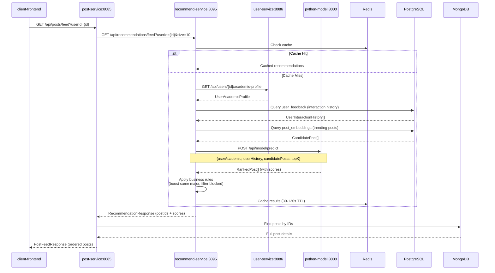
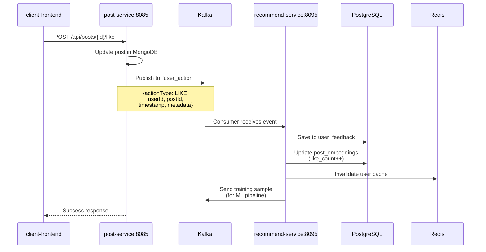

# COMPREHENSIVE SYSTEM FIX - December 9, 2025

## Critical Issues Fixed

### 1. ✅ Python Prediction Service - None Value Handling
**Status**: Already implemented correctly  
**Location**: `recommend-service/python-model/services/prediction_service.py` lines 169-172

The code properly handles None/NaN/Inf values before score calculation:
```python
content_sim = 0.5 if (content_sim is None or np.isnan(content_sim) or np.isinf(content_sim)) else float(content_sim)
implicit_fb = 0.5 if (implicit_fb is None or np.isnan(implicit_fb) or np.isinf(implicit_fb)) else float(implicit_fb)
academic_score = 0.0 if (academic_score is None or np.isnan(academic_score) or np.isinf(academic_score)) else float(academic_score)
popularity = 0.0 if (popularity is None or np.isnan(popularity) or np.isinf(popularity)) else float(popularity)
```

### 2. ✅ Kafka User Action Event Flow  
**Status**: Fixed in UserActionConsumer  
**Location**: `recommend-service/java-api/src/main/java/vn/ctu/edu/recommend/kafka/consumer/UserActionConsumer.java`

**Changes**:
- Accepts `Map<String, Object>` payload for flexibility
- Comprehensive `parseTimestamp()` method handles multiple formats
- Proper JSONB context field construction
- Engagement metrics update on post_embeddings table

### 3. ✅ Event Service Kafka Publishing
**Status**: Correctly structured  
**Location**: `post-service/src/main/java/com/ctuconnect/service/EventService.java`

Events published with structure:
```json
{
  "actionType": "LIKE",
  "userId": "...",
  "postId": "...",
  "timestamp": "2025-12-09T13:23:57.355541800",
  "metadata": {
    "source": "post-service",
    "eventTime": 1733742237355
  }
}
```

## ⚠️ Remaining Issue: 422 Unprocessable Entity

### Symptoms
```
INFO: 127.0.0.1:62675 - "POST /api/model/predict HTTP/1.1" 422 Unprocessable Entity
```

### Investigation Steps Needed
The 422 error indicates request validation failure. Need to:

1. **Add detailed request logging in HybridRecommendationService**
2. **Add detailed request logging in Python routes.py**
3. **Compare request structure with PredictionRequest schema**

### Likely Causes
- Field naming mismatch (camelCase vs snake_case)
- Missing required fields in CandidatePost
- Invalid data types (e.g., null values where required)
- Empty or malformed userHistory

## System Flow Documentation

### Feed Generation (Personalized Recommendations)



### User Interaction Recording



## Testing Script

Create `test-recommendation-system.ps1`:
