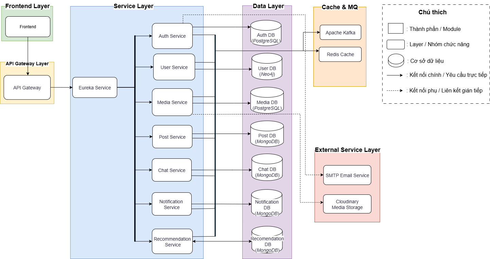
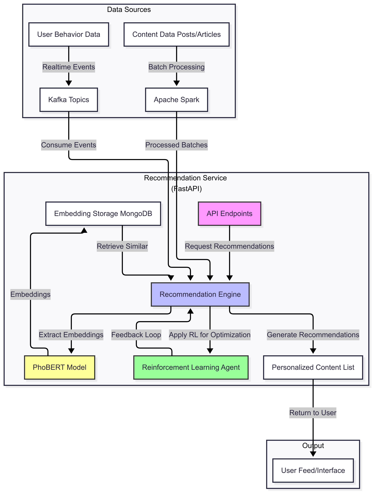
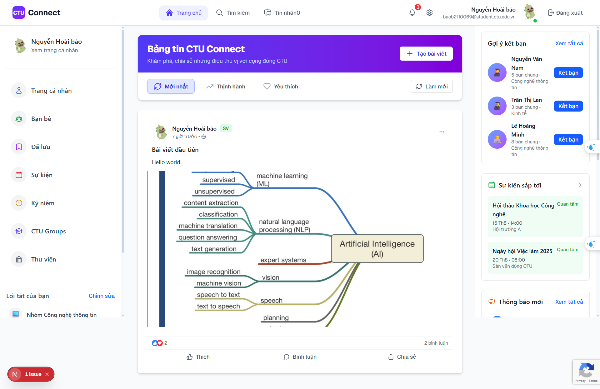

# CTU Connect (Can Tho University Connect)
**Note: This project is currently under development, and some features or services may not be fully implemented.**

A comprehensive social networking platform built with microservices architecture, designed to connect students, faculty, and staff at Can Tho University.

## 📋 Table of Contents

- [Overview](#overview)
- [Architecture](#architecture)
- [Services](#services)
- [Technology Stack](#technology-stack)
- [Prerequisites](#prerequisites)
- [Quick Start](#quick-start)
- [Development Setup](#development-setup)
- [API Documentation](#api-documentation)
- [Monitoring and Health Checks](#monitoring-and-health-checks)
- [Troubleshooting](#troubleshooting)
- [Contributing](#contributing)
- [License](#license)

## 🔍 Overview

CTU Connect is a modern social networking platform that implements a microservices architecture using Spring Boot, Spring Cloud, and related technologies. The platform provides features for user authentication, social interactions, content management, real-time messaging, and AI-powered content recommendations.

### Key Features

- **User Management**: Registration, authentication, profile management
- **Social Networking**: Posts, comments, likes, follows, news feed
- **Real-time Chat**: Instant messaging and notifications
- **Media Management**: Image and file uploads with cloud storage
- **Content Recommendation**: AI-powered content suggestions
- **Admin Dashboard**: Platform administration and analytics
- **Responsive Design**: Modern web and mobile-friendly interface

## 🏗️ Architecture

### System Architecture


The platform follows a distributed microservices architecture pattern with:
- **Service Discovery**: Eureka Server for service registration and discovery
- **API Gateway**: Single entry point for all client requests
- **Event-Driven Communication**: Apache Kafka for asynchronous messaging
- **Distributed Caching**: Redis for session management and caching
- **Multiple Databases**: PostgreSQL, MongoDB, and Neo4j for different data needs

### Recommendation Service Flow


### User Interface


## 🚀 Services

| Service | Port | Technology | Database | Description |
|---------|------|------------|----------|-------------|
| **Eureka Server** | 8761 | Spring Cloud Netflix | - | Service discovery and registration |
| **API Gateway** | 8090 | Spring Cloud Gateway | - | Request routing and load balancing |
| **Auth Service** | 8080 | Spring Boot | PostgreSQL | Authentication and authorization |
| **User Service** | 8081 | Spring Boot | Neo4j | User profiles and social connections |
| **Media Service** | 8084 | Spring Boot | PostgreSQL | File uploads and media management |
| **Post Service** | 8085 | Spring Boot | MongoDB | Content creation and social posts |
| **Chat Service** | 8083 | Spring Boot | MongoDB | Real-time messaging |
| **Recommendation Service** | 8086 | FastAPI/Python | MongoDB | AI-powered content recommendations |
| **Client Frontend** | 3000 | Next.js | - | User-facing web application |
| **Admin Frontend** | 3001 | Next.js | - | Administrative dashboard |

## 🛠️ Technology Stack

### Backend Services
- **Framework**: Spring Boot 3.x, Spring Cloud
- **Languages**: Java 17, Python 3.9+
- **Security**: Spring Security, JWT tokens
- **API**: RESTful APIs, WebSocket for real-time features

### Databases
- **PostgreSQL**: User authentication, media metadata
- **MongoDB**: Posts, messages, recommendations data
- **Neo4j**: Social graph relationships
- **Redis**: Caching and session storage

### Infrastructure
- **Message Broker**: Apache Kafka (KRaft mode)
- **Containerization**: Docker & Docker Compose
- **Service Discovery**: Netflix Eureka
- **API Gateway**: Spring Cloud Gateway
- **Cloud Storage**: Cloudinary for media files

### Frontend
- **Framework**: Next.js 15 with React 19
- **Styling**: Tailwind CSS
- **State Management**: TanStack Query
- **Real-time**: WebSocket & STOMP protocol

## 📋 Prerequisites

Before running CTU Connect, ensure you have the following installed:

- **Docker** (version 20.0 or higher)
- **Docker Compose** (version 2.0 or higher)
- **Git** for version control

### For Local Development
- **Java 17** or higher
- **Maven 3.8+**
- **Node.js 18+** and **npm/yarn**
- **Python 3.9+** (for recommendation service)

## 🚀 Quick Start

### 1. Clone the Repository
```bash
git clone https://github.com/your-username/ctu-connect.git
cd ctu-connect
```

### 2. Environment Configuration
Copy the environment template and configure your settings:
```bash
cp .env.example .env
```

Edit the `.env` file with your specific configurations:
```bash
# Database Configuration
POSTGRES_USER=your_db_user
POSTGRES_PASSWORD=your_db_password

# Service Ports
EUREKA_PORT=8761
API_GATEWAY_PORT=8090
AUTH_SERVICE_PORT=8080
USER_SERVICE_PORT=8081

# External Services
CLOUDINARY_CLOUD_NAME=your_cloudinary_name
CLOUDINARY_API_KEY=your_api_key
CLOUDINARY_API_SECRET=your_api_secret

# Email Configuration (for notifications)
MAIL_HOST=smtp.gmail.com
MAIL_PORT=587
MAIL_USERNAME=your_email@gmail.com
MAIL_PASSWORD=your_app_password
```

### 3. Start All Services
```bash
docker-compose up -d
```

### 4. Verify Services
Wait for all services to start (may take 2-3 minutes), then check their status:
```bash
# Check all running containers
docker-compose ps

# View service logs
docker-compose logs -f [service-name]
```

### 5. Access the Applications

| Application | URL | Description |
|-------------|-----|-------------|
| **User Dashboard** | http://localhost:8761 | Eureka service discovery |
| **API Gateway** | http://localhost:8090 | Main API endpoint |
| **Client App** | http://localhost:3000 | User-facing application |
| **Admin Panel** | http://localhost:3001 | Administrative dashboard |
| **Neo4j Browser** | http://localhost:7474 | Graph database interface |

## 💻 Development Setup

### Backend Development

1. **Start Infrastructure Services Only**:
```bash
# Start databases, Redis, Kafka, and Eureka
docker-compose up -d auth_db media_db post_db recommendation_db neo4j redis kafka eureka-server
```

2. **Run Services Locally**:
```bash
# Start each service in development mode
cd auth-service && mvn spring-boot:run
cd user-service && mvn spring-boot:run
cd post-service && mvn spring-boot:run
# ... repeat for other services
```

### Frontend Development

1. **Client Frontend**:
```bash
cd client-frontend
npm install
npm run dev
```

2. **Admin Frontend**:
```bash
cd admin-frontend
npm install
npm run dev
```

### Recommendation Service (Python)

```bash
cd recommendation-service
pip install -r requirements.txt
python main.py
```

## 📚 API Documentation

### Authentication Endpoints
```
POST /auth/login          # User login
POST /auth/register       # User registration
POST /auth/refresh        # Refresh JWT token
POST /auth/logout         # User logout
```

### User Management
```
GET  /users/profile       # Get user profile
PUT  /users/profile       # Update profile
GET  /users/{id}/posts    # Get user posts
POST /users/{id}/follow   # Follow user
```

### Content Management
```
GET  /posts               # Get news feed
POST /posts               # Create new post
PUT  /posts/{id}          # Update post
DELETE /posts/{id}        # Delete post
POST /posts/{id}/like     # Like/unlike post
```

### Media Operations
```
POST /media/upload        # Upload files
GET  /media/{id}          # Get media file
DELETE /media/{id}        # Delete media
```

For detailed API documentation, start the services and visit:
- Swagger UI: `http://localhost:8090/swagger-ui.html`

## 📊 Monitoring and Health Checks

### Health Check Endpoints
All services provide health check endpoints:
```
GET /actuator/health      # Service health status
GET /actuator/info        # Service information
GET /actuator/metrics     # Service metrics
```

### Service Status Dashboard
Monitor all services through Eureka Dashboard:
```
http://localhost:8761
```

### Database Monitoring
- **Neo4j Browser**: http://localhost:7474 (neo4j/password)
- **PostgreSQL**: Connect via any PostgreSQL client on ports 5433, 5434
- **MongoDB**: Connect via MongoDB client on ports 27018, 27019

## 🔧 Troubleshooting

### Common Issues

1. **Services Won't Start**:
```bash
# Check Docker resources
docker system df
docker system prune

# Restart with fresh containers
docker-compose down -v
docker-compose up -d
```

2. **Database Connection Issues**:
```bash
# Check database logs
docker-compose logs auth_db
docker-compose logs neo4j

# Reset database volumes
docker-compose down -v
docker volume prune
```

3. **Port Conflicts**:
```bash
# Check what's using your ports
netstat -tulpn | grep :8080

# Modify ports in .env file if needed
```

4. **Memory Issues**:
```bash
# Increase Docker memory limit
# On Windows/Mac: Docker Desktop → Settings → Resources
# On Linux: Modify Docker daemon configuration
```

### Debugging Services

View detailed logs for specific services:
```bash
# View all service logs
docker-compose logs -f

# View specific service logs
docker-compose logs -f auth-service
docker-compose logs -f recommendation-service

# View last 100 lines
docker-compose logs --tail=100 post-service
```

### Performance Optimization

1. **For Development**:
   - Increase Docker memory allocation to at least 8GB
   - Use SSD storage for better performance
   - Enable Docker BuildKit for faster builds

2. **For Production**:
   - Configure appropriate JVM heap sizes
   - Set up database connection pooling
   - Implement proper caching strategies
   - Use production-grade message brokers

## 🤝 Contributing

We welcome contributions to CTU Connect! Please follow these steps:

1. **Fork the Repository**
2. **Create a Feature Branch**: `git checkout -b feature/your-feature-name`
3. **Make Your Changes**
4. **Run Tests**: Ensure all tests pass
5. **Commit Your Changes**: Use conventional commit messages
6. **Push to Your Fork**: `git push origin feature/your-feature-name`
7. **Submit a Pull Request**

### Development Guidelines

- Follow Java coding standards and Spring Boot best practices
- Write comprehensive tests for new features
- Update documentation for any API changes
- Use meaningful commit messages
- Ensure Docker containers build successfully

### Code Style

- **Java**: Follow Google Java Style Guide
- **JavaScript/TypeScript**: Use ESLint and Prettier configurations
- **Python**: Follow PEP 8 standards

## 🛡️ Security

- JWT tokens for stateless authentication
- CORS configuration for secure cross-origin requests
- Input validation and sanitization
- SQL injection prevention with JPA
- Rate limiting on API endpoints
- Secure file upload validation

## 📄 License

This project is licensed under the MIT License - see the [LICENSE](LICENSE) file for details.

## 🙏 Acknowledgments

- Can Tho University for project sponsorship
- Spring Boot and Spring Cloud communities
- All contributors and maintainers

---

**Note**: This is an academic project developed as part of a graduation thesis (LVTN) at Can Tho University. For production deployment, additional security hardening and performance optimization may be required.
